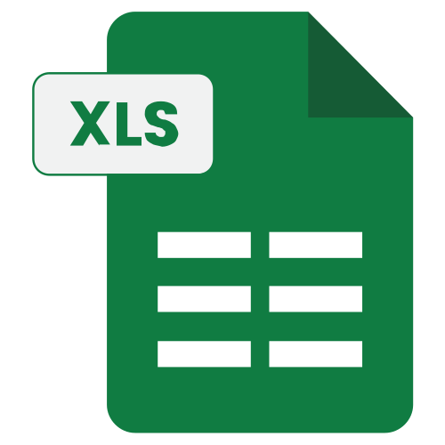

  

---

## 🔧 Technical Toolkit

<table align="center">
  <tr>
    <td align="center"> <b>Python</b></td>
    <td align="center"> <b>R</b></td>
    <td align="center"> <b>JavaScript</b></td>
    <td align="center"> <b>TypeScript</b></td>
    <td align="center"> <b>Node.js</b></td>
    <td align="center"> <b>React</b></td>
  </tr>
  <tr>
    <td align="center"> <b>FastAPI</b></td>
    <td align="center"> <b>Supabase</b></td>
    <td align="center"> <b>BigQuery</b></td>
    <td align="center"> <b>Excel</b></td>
    <td align="center"> <b>Power BI</b></td>
    <td align="center"> <b>Tableau</b></td>
  </tr>
  <tr>
    <td align="center"> <b>Apps Script</b></td>
    <td align="center"> <b>Looker Studio</b></td>
    <td align="center"> <b>OpenAI API</b></td>
    <td align="center"> <b>Anthropic API</b></td>
    <td align="center"> <b>GitHub API</b></td>
    <td align="center"> <b>SQL</b></td>
  </tr>
</table>

---

## 🚀 Featured Projects

---

*Session-based job acquisition automation for Upwork freelancers — 9-component AI scoring engine, GPT-4o-mini proposal generation, and full pipeline tracking from log to hire*

*Password-protected daily productivity dashboard — time-blocked planning, vertical calendar view, and bidirectional Google Docs sync, built with Google Apps Script*

*Multi-page Power BI dashboard for K-12 institutions — Teacher and Administrator role-based views with row-level security, DAX KPI measures, and bookmark navigation*

---

*Personalized 30-day curriculum built from Alex The Analyst's bootcamp via NotebookLM MCP — lesson plan, study guide, 3 quizzes, 78-card flashcard deck, and printable workbook*

---

*LeetCode + real-world business analytics queries*

---

*Multi-section Excel analytics dashboard visualizing a freelance client acquisition pipeline — BigQuery exports → KPI tiles, keyword intelligence, proposal performance, and connect efficiency tracking*

*Python analytics notebooks — data cleaning, EDA, and visualization across public datasets*

*Industry, region, and company analysis for supply chain career targeting*

---

*End-to-end analysis of shipment reliability, cost, and SLA risk across modes, vendors, and geographies — Google Sheets / Python / SQL / R / Tableau / BigQuery*

*Integrated Tableau dashboard analyzing forecast accuracy, inventory risk, safety stock alignment, and pricing strategy — Excel / Tableau*

*SWOT analysis + Lean Six Sigma case studies applied to real supply chain scenarios*

---

*End-to-end analytics system tracking income, expenses, work performance KPIs, forecasting, and weekly scorecards — Google Sheets / Apps Script / Excel / Looker Studio*

*Business analytics case studies in R — operational analysis and decision support*

---

*End-to-end ETL pipeline: Python / R data ingestion → SQL analysis → Tableau visualization*

---

## 📊 GitHub Stats

  
  

  

---

| Credential | Issuer | Verify |
|------------|--------|--------|
| **Google Data Analytics** | Google | [Verify](https://coursera.org/verify/professional-cert/XN9RSCLFQ7HS) |
| **Supply Chain Management** | Rutgers | [Verify](https://coursera.org/verify/specialization/7AZ8IF5EPC33) |
| **Career Success** | UC Irvine | [Verify](https://coursera.org/verify/specialization/Y94B8WHNGFWC) |
| **Introduction to Business** | UC Irvine | [Verify](https://www.coursera.org/account/accomplishments/specialization/26P3GRJURKPB) |

---

- **Power BI / DAX**
- **Machine Learning for Supply Chain Forecasting**
- **Advanced SQL Optimization**
- **AWS Certified Cloud Practitioner**
- **Six Sigma Green Belt** (ASQ -- in progress)
- **SNHU BS Supply Chain Management** (in progress)

---

📄 **Resume**: [Download PDF](https://github.com/visualkirby/visualkirby/blob/main/Resume.PDF)
